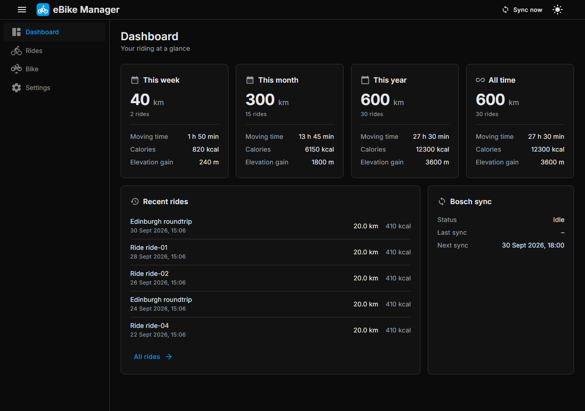
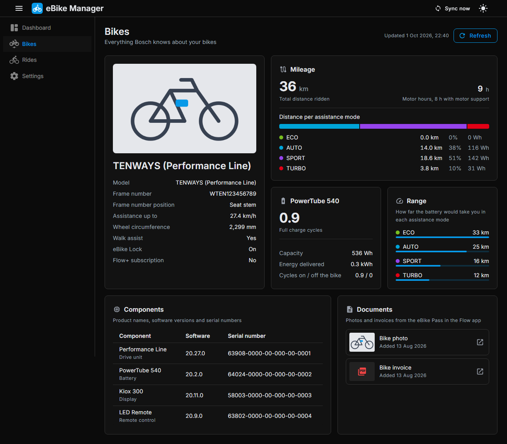
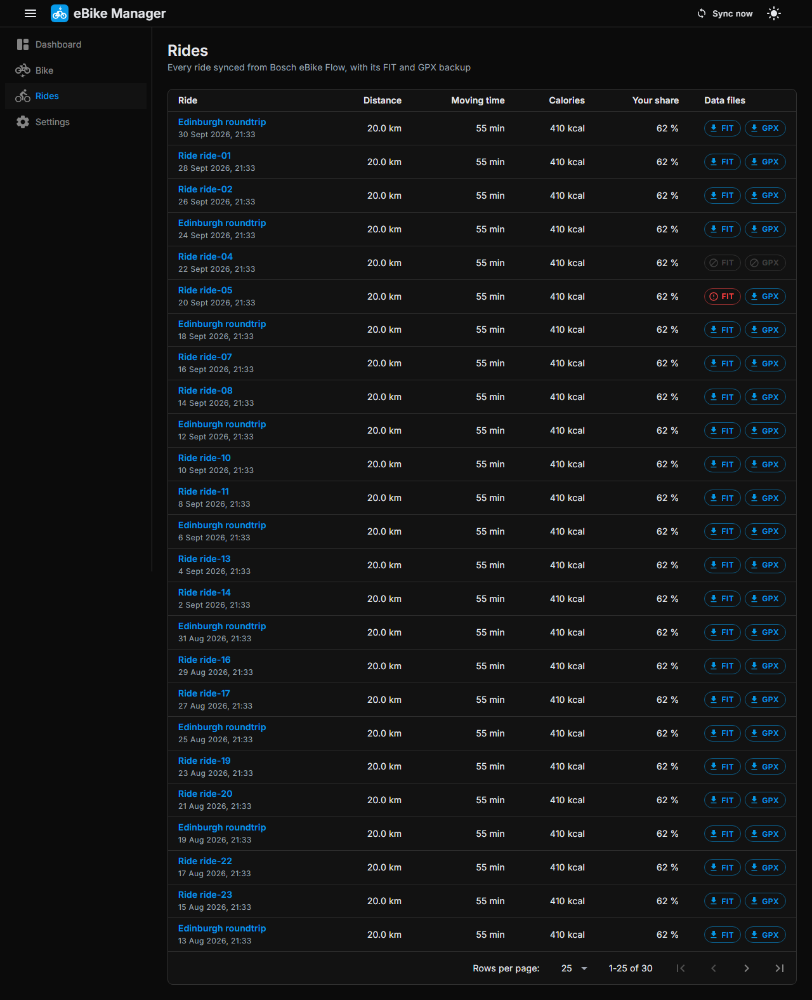
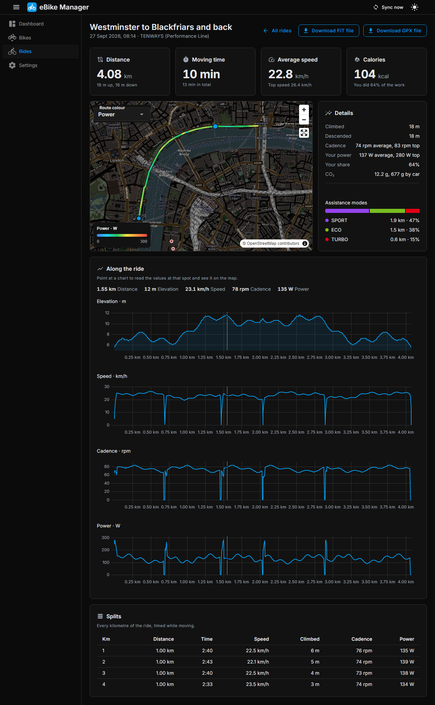
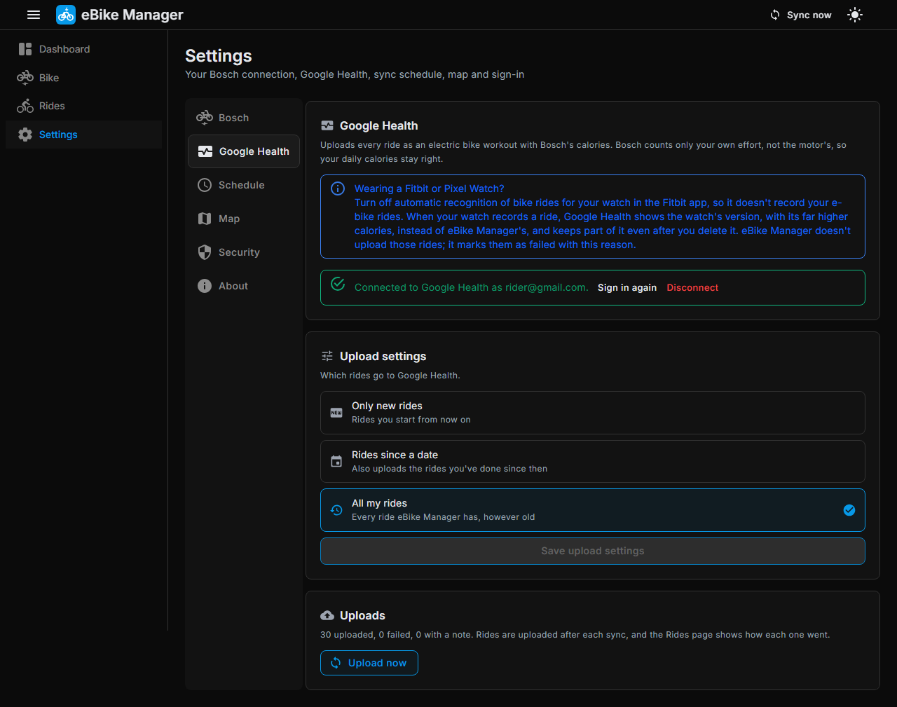

<p align="center">
  
</p>

# eBike Manager

[](https://github.com/remotesojourner/eBikeManager/actions/workflows/ci.yml)
[](https://github.com/remotesojourner/eBikeManager/releases/latest)
[](https://github.com/remotesojourner/eBikeManager/releases)
[](LICENSE)

A self-hosted Blazor Server app for Bosch eBike Flow riders. It keeps a copy of every ride, with its FIT file, shows your rides and your bike in one place without depending on the Flow app, and uploads your rides to Google Health with Bosch's calories.

> [!NOTE]
> eBike Manager isn't made by, affiliated with or endorsed by Bosch. It talks to the same cloud service the Bosch eBike Flow app uses, which Bosch doesn't document and may change at any time.

---

## Features

- **Ride sync** — fetches your rides from Bosch eBike Flow on a schedule you choose (every hour by default), for the bikes you pick
- **FIT and GPX backup** — downloads every ride's FIT file, checks it, and keeps it on your own disk next to Bosch's ride summary and the ride's GPX file, filed by date. The first sync backs up your whole history
- **Dashboard** — distance, rides, moving time, calories and elevation for this week, this month, this year and all time, your latest rides, your bike's mileage and battery, and the state of the sync
- **Rides** — every ride with its distance, moving time, Bosch's calories, your share of the effort, and download buttons for its FIT and GPX files. Click a ride anywhere to open it
- **Ride details** — the route on a map, coloured by speed, power, cadence, gradient or heart rate on the same scale for every ride, the ride's figures, how far you rode in each assistance mode, ABS interventions on bikes with ABS, charts of elevation, speed, cadence and power along the ride, and a split for every kilometre or mile. Point at a chart to read the values there and see the spot on the map
- **Maps your way** — OpenStreetMap by default, OpenFreeMap with a dark version for the dark theme, or a MapLibre style from your own map server
- **Miles or kilometres** — distances, speeds and heights in kilometres, km/h and metres, or in miles, mph and feet
- **Bikes** — each bike's picture, frame number and where to find it, mileage with the distance, energy and Wh per km in each assistance mode, motor hours, whether Bosch detected tuning, battery (capacity, charge cycles, energy delivered), range in each assistance mode, every component with its software version and serial number, and the photos and invoices from your eBike Pass. With a ConnectModule it adds the live battery state, how long until it's full while charging, and the last known location
- **Google Health integration** — uploads each ride as an electric bike workout with Bosch's calories, which count only your own effort, not the motor's. It lists every upload with its result. A ride your watch also recorded isn't uploaded, because Google Health only shows the watch's version (see the [FAQ](#what-happens-when-my-watch-recorded-the-same-ride)). Any ride can also be uploaded on its own from the Rides list or its ride page, even one from before your start date
- **Local by design** — every page is built from what's stored on your server. eBike Manager contacts Bosch only while syncing, and serves its own copy of your bike's picture, eBike Pass documents, fonts and map code. The one exception is the map itself, which your browser loads from the map server you choose; with your own map server, nothing leaves your network. Notifications go only to the services you add
- **Sign-in** — optional sign-in with your own OpenID Connect provider, such as Authentik, Authelia, Keycloak or Pocket ID. When it's on, nothing is shown until you've signed in
- **eBike bridge** — reads the live battery level and bike values from [Xunil99's Bosch eBike LDI bridge](https://xunil99.github.io/ha-bosch-ebike/), an ESP32 board you flash from that page, over ESPHome's own API, encrypted or not, with no Home Assistant needed. It keeps the battery level and the odometer, and shows speed, cadence, power, charging, lock and light while the bike is connected. A dual bridge feeds two bikes
- **Notifications** — a message on Discord, Telegram, Gotify, ntfy, Pushover, any service Apprise supports, or your own webhook when a new ride syncs, a ride fails to upload, Bosch or Google Health needs you to sign in again, or syncing fails and works again. Every message can be turned off or reworded
- **Statistics API** — `GET /api/statistics` returns your number of bikes, rides, total distance, moving time, elevation gain and calories as JSON, for Home Assistant or your own scripts. With sign-in on, it takes an API token from the Security tab
- **Docker-ready** — one container, one data folder, and a `/healthz` endpoint for Docker's health check

---

## Screenshots

### Dashboard



### Bikes



### Rides



### Ride details



### Google Health



---

## Prerequisites

| Requirement | Notes |
|---|---|
| Docker + Docker Compose | Recommended deployment method. Images are published for `linux/amd64` and `linux/arm64` |
| A Bosch eBike Flow account | For a bike with the Bosch smart system, the one the eBike Flow app works with |
| A desktop or laptop browser | Needed once, to sign in to Bosch (see [Connecting Bosch eBike Flow](#connecting-bosch-ebike-flow)) |
| Internet access | To reach Bosch's cloud service, and Google if you upload rides |
| A Google account and a Google Cloud project | Only for the Google Health integration (see [Connecting Google Health](#connecting-google-health)) |
| A reverse proxy with HTTPS on your own domain | Only for the Google Health integration, e.g. `https://ebike.example.com`. Google only returns its sign-in to such an address |
| An OpenID Connect provider | Only if you want sign-in (see [Tab: Security](#tab-security)) |

---

## Quick Start (Docker Compose)

1. **Create a `docker-compose.yml`** with the following content:

   ```yaml
   services:
     ebike-manager:
       container_name: ebike-manager
       restart: unless-stopped
       image: ghcr.io/remotesojourner/ebikemanager:latest
       ports:
         - "2004:2004"
       volumes:
         - ./data:/app/data
   ```

   **Volume notes:**
   - `./data/storage.db` — the SQLite database with your settings, rides, bike details, bike pictures and upload history.
   - `./data/keys` — the keys that encrypt your Bosch and Google logins and keep sign-in cookies valid across restarts. Keep them with the database; without them you have to connect Bosch and Google again.
   - `./data/fit` — the ride backup, filed as `fit/2026/09/2026-09-30_0943_<ride id>.fit` in the ride's local time. Beside each FIT file are a `.json` file with Bosch's summary of the ride and a `.gpx` file with its GPS track, kept exactly as Bosch sent it. The GPX file has only position, elevation and time; the FIT file also has speed, cadence, power and distance.

   **Image tags:** `latest` is the newest release, and `X.Y.Z`, `X.Y` and `X` pin one. To try changes before they're released, use `beta` (the newest beta build), `X.Y.Z-beta` (the newest build towards that version) or `X.Y.Z-beta.N` (one exact build). Beta builds may change or break between builds.

2. **Start the stack**

   ```bash
   docker compose up -d
   ```

   The app will be available on port `2004` of the host you deployed it on (e.g. `http://192.168.1.100:2004`).

3. **Complete the welcome steps**

   The first visit walks you through connecting your Bosch eBike Flow account, choosing your bikes and picking how often to sync. When you finish, the first sync starts and backs up your whole ride history.

4. **Review the Settings page**

   Open **Settings** to change the schedule, add a bike, choose the map or turn on sign-in (see [Configuration](#configuration) below).

5. **Connect Google Health (optional)**

   Open **Settings**, **Google Health** to upload your rides to Google Health (see [Connecting Google Health](#connecting-google-health)).

---

## Configuration

Everything is configured in the browser and stored in the database. A few environment variables only control how the app is hosted.

### Environment Variables

| Variable | Default | Description |
|---|---|---|
| `PORT` | `2004` | Port the app listens on. Change the port mapping in `docker-compose.yml` to match |
| `DATA_DIRECTORY` | `data` in the working directory | Folder for the database, keys and FIT backup. The Docker image mounts a volume at `/app/data`, so leave it unset there |
| `DISABLE_AUTH` | — | Set to `true` to turn sign-in off. Use it if the sign-in settings lock you out, correct them under **Settings → Security**, then remove it again |

### Connecting Bosch eBike Flow

Bosch's login only hands its result to the eBike Flow app, so eBike Manager can't receive it directly. Instead you copy it from your browser's developer tools, the same method the [ha-bosch-ebike-flow](https://github.com/marq24/ha-bosch-ebike-flow) Home Assistant integration uses:

1. Use a desktop or laptop browser. On a phone, the Flow app takes over the login.
2. Click **Open Bosch login**. It opens in a new tab.
3. In that tab, open the developer tools (<kbd>F12</kbd>, or <kbd>Cmd</kbd>+<kbd>Option</kbd>+<kbd>I</kbd> on a Mac) and select the **Network** tab before signing in.
4. Sign in with your Bosch eBike Flow account. After the password the page stops loading; that's expected.
5. Type `oauth2redirect` into the Network filter box, right-click the request that shows up, and choose **Copy → Copy URL**.
6. Paste it into eBike Manager and click **Connect** straight away. The code in it expires after about a minute.

eBike Manager then keeps itself signed in. The login is stored encrypted in the data folder. If Bosch ever stops accepting it, the sync reports it and **Settings → Bosch** asks you to sign in again.

---

### Connecting Google Health

Google Health needs two things:
- **A reverse proxy with HTTPS on your own domain**, such as `https://ebike.example.com`. At the end of sign-in, Google sends your browser back to eBike Manager, and it only does that to an HTTPS address on a domain name, never to `http://192.168.1.100:2004`. Open eBike Manager at that address when you connect.
- **An OAuth client from your own Google Cloud project.** Google only lets verified apps handle other people's health data. With your own project you are its only user, and your rides go straight from your server to Google.

The **Google Health** tab in **Settings** walks you through it:

1. Create a project in the [Google Cloud console](https://console.cloud.google.com/).
2. [Enable the Google Health API](https://console.cloud.google.com/apis/library/health.googleapis.com) for it.
3. In [Google Auth Platform](https://console.cloud.google.com/auth/overview), set the app up for **External** users and add your Google account as a test user. The app can stay in testing.
4. [Create an OAuth client](https://console.cloud.google.com/auth/clients) of type **Web application**. Add the **authorized redirect URI** shown on the Google Health tab, `https://<your domain>/integrations/google-health/callback`. Then enter the client ID and secret on that tab.
5. Choose which rides to upload, then click **Sign in with Google**. Google warns that the app hasn't been verified or is still being tested; continue, since it's your own app.
6. Allow access to your activity and fitness data. Google brings you back to eBike Manager, which finishes connecting.

eBike Manager keeps the Google login encrypted in the data folder and renews it by itself.

---

### Tab: Bosch

| Field | Description |
|---|---|
| **Bosch eBike Flow account** | Which account is connected, and **Sign in again** if Bosch stopped accepting the login |
| **Bikes** | The bikes whose rides are synced. Adding a bike reads its whole ride history on the next sync |

### Tab: Bridge

Connects eBike Manager to [Xunil99's Bosch eBike LDI bridge](https://xunil99.github.io/ha-bosch-ebike/), an ESP32 board that connects to your bike over Bluetooth. Follow the instructions on [its page](https://xunil99.github.io/ha-bosch-ebike/): it lists what you need (an ESP32 dev board and a USB data cable), flashes the firmware straight from Chrome or Edge (the single bridge for one bike, the dual bridge for two), puts the bridge on your Wi-Fi and pairs it with your bike. eBike Manager then talks to it over ESPHome's API on your network, so you don't need Home Assistant, and Home Assistant can stay connected at the same time. The **Bridge** tab links to the same page.

| Field | Description |
|---|---|
| **Address** | The bridge's IP address, or its name if your network resolves it, with `:port` if it isn't 6053. Leave it empty to stop using the bridge |
| **Encryption key** | The key under `api: encryption: key:` in the bridge's YAML, if it has one. It's stored encrypted |
| **Bike** | The bike the bridge is paired with. With one bike it's chosen for you |
| **The bridge's eBike 1 / eBike 2** | For a dual bridge: which of your bikes each half is paired with. The bridge itself doesn't say, so each picker shows that half's odometer and warns when it's lower than Bosch's odometer for the chosen bike, which means the two are swapped |

The status line says whether eBike Manager is connected, and why not: a missing, unneeded or wrong encryption key, or a bridge it can't reach. It keeps trying in the background, from every 5 seconds up to every 5 minutes.

eBike Manager keeps only the battery level and the odometer, each with the time it was read. The Bikes page and the dashboard show that battery level, and the bike's mileage is the higher of Bosch's odometer and the bridge's. Speed, cadence, your power, charging, the time until charged, lock, light and the rest appear on the Bikes page only while the bike is connected to the bridge, because they mean nothing once it isn't.

### Tab: Google Health

| Field | Description |
|---|---|
| **Authorized redirect URI** | The address to add to your OAuth client, built from the address you opened eBike Manager at. When that isn't an HTTPS domain, the page explains the reverse proxy requirement instead |
| **Client ID / Client secret** | The Web application OAuth client from your Google Cloud project |
| **Which rides to upload** | Only new rides (the default), rides since a date, or all your rides. Every ride is uploaded once, after the sync that brings it in |
| **Rides your watch recorded** | Before uploading a ride, eBike Manager checks whether your watch or tracker recorded a bike ride at the same time. Google Health shows the watch's version instead of eBike Manager's, and keeps part of it even after you delete it. So those rides aren't uploaded: they show as **Failed** with the reason, aren't retried by the sync, and any earlier upload of them is removed. If you wear a Fitbit or Pixel Watch, turn off automatic recognition of bike rides in the Fitbit app, so future rides go through |
| **Uploads** | How many rides were uploaded, failed or uploaded with a note. **Upload now** runs a sync straight away. Each ride's result is on the **Rides** page: a green cloud once it's uploaded, an amber one when Google Health accepted it with a note, and a red upload button when it failed. Hover over it for the details |
| **Upload a single ride** | While Google Health is connected, every ride on the **Rides** list has an upload button, and so does each ride page. It uploads that ride even if it's older than your start date. Once it's uploaded, a green cloud with a tick shows instead, and the ride page offers **Upload to Google Health again** to check the ride again |
| **Sign in again / Disconnect** | Renew the Google sign-in, or disconnect. Disconnecting tells Google to forget eBike Manager's access; rides already uploaded stay in Google Health |

Each ride becomes an **Electric bike** workout with its start and end, moving time, distance, climb, average speed and Bosch's calories. Failed uploads are tried again on the next sync.

### Tab: Notifications

**Add notification** offers Discord, Telegram, Gotify, ntfy, Pushover, Apprise and a webhook. Each has its own fields (a webhook URL, a bot token, a topic and so on), a switch for every kind of message, and a text for each message that you can rewrite with placeholders such as `%title%`, `%distance%`, `%moving_time%`, `%calories%`, `%service%` and `%error%`. Distances and speeds follow your units. **Send test** sends a new-ride message for your latest ride, without saving anything.

| Message | When it's sent |
|---|---|
| **New ride** | A sync finds a ride that has finished since the last one. The first sync, which backs up your whole history, sends none |
| **Ride failed to upload** | A ride fails to upload to Google Health for the first time. It's tried again on the next sync without another message |
| **Sign-in needed** | Bosch or Google Health has ended eBike Manager's sign-in. Sent once, until you sign in again |
| **Sync failed / works again** | Syncing stops working, and when it works again. An outage that lasts several syncs sends one message each way |

Messages go out at the end of each sync. The **webhook** posts JSON such as `{"event": "RIDE_SYNCED", "data": {"title": "…", "distanceMeters": 20000, …}}` (always metric), and can also send a keep-alive every few minutes. To get a phone notification through Home Assistant, add an automation with a **Webhook** trigger and use its URL here:

```yaml
triggers:
  - trigger: webhook
    webhook_id: ebike-manager
    allowed_methods: [POST]
    local_only: true
conditions:
  - condition: template
    value_template: "{{ trigger.json.event == 'RIDE_SYNCED' }}"
actions:
  - action: notify.mobile_app_your_phone
    data:
      title: "New ride: {{ trigger.json.data.title }}"
      message: "{{ (trigger.json.data.distanceMeters / 1000) | round(1) }} km, {{ trigger.json.data.caloriesKcal | int }} kcal"
```

### Tab: Schedule

| Field | Description |
|---|---|
| **Sync schedule** | Every 30 minutes, every hour (default), every 3 hours, every 6 hours, once a day, or your own cron expression. Cron expressions are evaluated in UTC. The next sync time is shown below the choices |
| **Sync now** | Fetches new rides straight away. The **Sync now** button in the header does the same |

Each sync reads Bosch's ride list, newest first, and stops at the first page with nothing new. Rides from the last 7 days are always read again, because Bosch sometimes finishes processing a ride after you've stopped. The sync then downloads any missing FIT and GPX files (rides backed up before GPX files were kept get theirs this way), and refreshes your bikes' details. A bike's picture is downloaded only when Bosch's picture changes, and its eBike Pass photos and invoices only when you add or change them in the Flow app.

### Tab: Display

| Field | Description |
|---|---|
| **Units** | **Metric** (kilometres, km/h and metres) or **Imperial** (miles, mph and feet), saved as soon as you choose. The welcome wizard asks too, and suggests imperial when your browser is set to US or UK English. Bosch, Google Health and the statistics API always use metric |
| **OpenStreetMap** | The standard map from openstreetmap.org (default). In the dark theme it's shown darkened |
| **OpenFreeMap** | Vector maps from [openfreemap.org](https://openfreemap.org), free and without an account, with a dark style for the dark theme |
| **Your own map server** | The address of a MapLibre `style.json` on a server you host, such as a self-hosted OpenFreeMap or TileServer GL, plus an optional dark style |
| **Preview** | Your latest ride on the chosen map, updated before you save |

Your browser loads the map from the chosen server, which sees which area you're looking at but never your rides.

### Tab: Security

Sign-in uses your own OpenID Connect provider. Create an application for eBike Manager there (a confidential client with a secret, or a public client without one) and register the redirect URI shown on this tab.

| Field | Description |
|---|---|
| **Require sign-in** | Send everyone to your provider before they see anything. Recommended unless only you can reach eBike Manager. There's no view for anyone who isn't signed in |
| **Provider address** | The issuer address your provider gives for the application, such as `https://auth.example.com/application/o/ebike-manager/`. It's checked when you save, so a wrong address can't lock you out |
| **Client ID / Client secret** | From the application in your provider. Leave the secret empty for a public client. The secret is stored encrypted |
| **Scopes** | `openid profile email` by default. `openid` is always included |
| **Redirect URI** | The address to register with your provider, `https://<your address>/signin-oidc` |

Turning sign-in on takes you to your provider straight away. Changing the provider or client signs everyone out. **Sign out** in the header ends your eBike Manager session; your provider may still have you signed in there. If the settings ever lock you out, start eBike Manager with `DISABLE_AUTH=true`, correct them, then remove the variable.

While sign-in is on, this tab also shows an **API token**, created the first time you open it. It only opens the statistics API below; every other page still needs signing in. It's stored encrypted, and **Generate a new token** replaces it, so the old one stops working straight away. Changing the provider doesn't change the token.

#### Statistics API

`GET /api/statistics` adds up every synced ride. It's open to anyone while sign-in is off. With sign-in on, send the API token, or call it from a browser where you're signed in.

```bash
curl -H "Authorization: Bearer ebm_…" https://ebike.example.com/api/statistics
```

```json
{
  "bikes": 1,
  "rides": 31,
  "mileageKm": 620.4,
  "movingTimeSeconds": 102300,
  "elevationGainMeters": 3720,
  "caloriesKcal": 12710
}
```

`bikes` counts the bikes you sync. The totals include every ride eBike Manager has, also those of a bike you no longer sync, and match the dashboard's **All time**. A missing or wrong token gets `401 Unauthorized`.

### Tab: About

| Field | Description |
|---|---|
| **Version** | The running version. When GitHub has a newer release, an update notice appears here and an icon in the header. The check needs internet access and runs at most every six hours |
| **Links** | The GitHub repository, the release notes, the issue tracker and the sponsor page |

---

## Development Setup

### Requirements

- .NET 10 SDK

### Run locally

```bash
dotnet run --project src/EBikeManager.Web
```

The app listens on `http://localhost:2004`, or on `PORT` if it's set. Its data goes to `src/EBikeManager.Web/data`.

### Tests

The unit tests (`tests/EBikeManager.UnitTests`) use fakes only. The integration tests (`tests/EBikeManager.IntegrationTests`) run real parts together: SQLite, the app over HTTP, and the app in a browser. None of them reach Bosch. Run both with:

```bash
dotnet test
```

The browser tests drive the app in Chromium with [Playwright](https://playwright.dev/dotnet/). Install Chromium once after building, or they're skipped:

```bash
pwsh tests/EBikeManager.IntegrationTests/bin/Debug/net10.0/playwright.ps1 install chromium
```

To leave them out, add `--filter-not-trait "Category=Browser"` to the test command.

### Database migrations

EF Core migrations are applied automatically on startup. To add a new migration during development:

```bash
dotnet ef migrations add <MigrationName> --project src/EBikeManager.Application --startup-project src/EBikeManager.Web --output-dir Data/Migrations
```

### Docker image

The `docker-compose.yml` in this repository builds the image from source:

```bash
docker compose up -d --build
```

---

## Technology Stack

| Component | Technology |
|---|---|
| Framework | ASP.NET Core 10, Blazor Server (Interactive Server render mode) |
| UI components | [MudBlazor](https://mudblazor.com/) with the [Modernity CSS](https://github.com/russkyc/modernity-css-experiment) patch, and the [Inter](https://rsms.me/inter/) typeface served locally |
| Database | SQLite via Entity Framework Core |
| Scheduling | [Cronos](https://github.com/HangfireIO/Cronos) |
| Health data | [Google Health API](https://developers.google.com/health) |
| Maps | [MapLibre GL JS](https://maplibre.org) with OpenStreetMap, [OpenFreeMap](https://openfreemap.org) or your own style |
| Charts | [uPlot](https://github.com/leeoniya/uPlot) |
| FIT files | [Garmin FIT SDK](https://developer.garmin.com/fit/) |
| Bosch sign-in | Based on [ha-bosch-ebike-flow](https://github.com/marq24/ha-bosch-ebike-flow) |
| eBike bridge | [ESPHome](https://esphome.io)'s native API, with Noise encryption through [BouncyCastle](https://www.bouncycastle.org/) for X25519; made for [Xunil99's Bosch eBike LDI bridge](https://github.com/Xunil99/ha-bosch-ebike) |
| Tests | xUnit v3, FakeItEasy, Playwright for the browser tests |
| Containers | Docker + Docker Compose |

---

## License

This project is licensed under the GNU Affero General Public License v3.0. See [LICENSE](LICENSE) for details.

---

## FAQ

### Why do I have to copy a URL from the developer tools?

Bosch's login sends its result to an address only the eBike Flow app can open. eBike Manager can't register an address of its own with Bosch, so you hand it over by copying it. You only do this once; after that eBike Manager keeps the login fresh by itself.

---

### Can the maps work without any outside server?

Yes. Host your own map tiles, for example with [OpenFreeMap's self-hosting guide](https://github.com/hyperknot/openfreemap) or TileServer GL, and enter its style address under **Settings → Map → Your own map server**. Everything else eBike Manager shows already comes from your own server.

---

### Which bikes work?

Bikes with the Bosch smart system, the ones the eBike Flow app supports. Older bikes that use the eBike Connect app don't.

---

### Why are Bosch's calories so much lower than my watch's?

On an eBike the motor does part of the work. Bosch works out your calories from your own effort, measured by the bike, while a watch estimates them from your heart rate as if you had done it all yourself. The FIT files Bosch exports contain no calories at all, so eBike Manager always uses the figure from Bosch's ride summary, and that's the figure it uploads to Google Health.

---

### Why does Google Health need a reverse proxy?

When you sign in, Google sends your browser back to eBike Manager with the sign-in attached, and it only sends it to addresses registered on your OAuth client. Google only accepts HTTPS addresses on a domain name there (and `localhost`, for a browser on the same computer), not `http://192.168.1.100:2004`. A reverse proxy with HTTPS gives eBike Manager such an address. You only need it for connecting; the uploads themselves go from eBike Manager to Google.

---

### What happens when my watch recorded the same ride?

It isn't uploaded. Google Health shows only one workout for a stretch of time and picks the watch's, so an uploaded ride next to it never appears. Changing or deleting the watch's ride doesn't help either: Google only lets an app change the data it added itself, and after you delete the watch's ride, Google still keeps part of it. eBike Manager marks those rides as **Failed** with the reason instead.

If you wear a Fitbit or Pixel Watch, turn off automatic recognition of bike rides in the Fitbit app, so the watch doesn't record your e-bike rides and eBike Manager's rides, with Bosch's calories, go through.

---

### Why can't eBike Manager find my bridge by its `.local` name?

Names like `ebike-bridge-1a2b3c.local` are announced with mDNS, which doesn't cross into Docker's default bridge network. Use the bridge's IP address instead, ideally with a DHCP reservation in your router so it doesn't change, or run the container with `network_mode: host`.

### Some bike details are missing. Why?

Bosch only reports what your bike has. The live battery state and the last known location come from a ConnectModule, and some figures only update after the bike has synced with the eBike Flow app.

Without a ConnectModule, Bosch's cloud doesn't know your battery's charge level at all. The eBike Flow app shows it because it reads it from the bike over Bluetooth. eBike Manager can't do that itself, but it can read it from an [eBike bridge](#tab-bridge).

The same goes for software updates and for the Bluetooth devices you paired with the bike, such as an eShift, a Mini Remote or a heart rate monitor: the Flow app learns about them from the bike itself, and they never reach Bosch's cloud.

---

### What happens if Bosch changes its service?

Syncing may stop until eBike Manager is updated. Your backed-up FIT files, and everything already in the database, stay where they are.

---

## A Note on AI

This project was built with extensive help from [Claude Code](https://claude.com/claude-code). I have been a C# developer for more than 20 years, I understand the code fully, and I refactor and rewrite it as I see fit.
